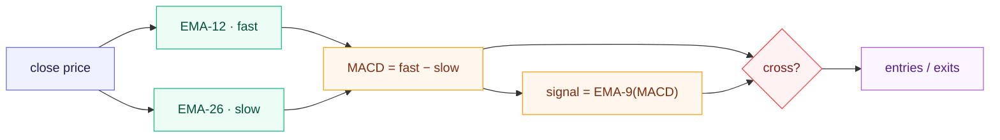
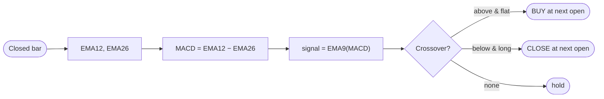
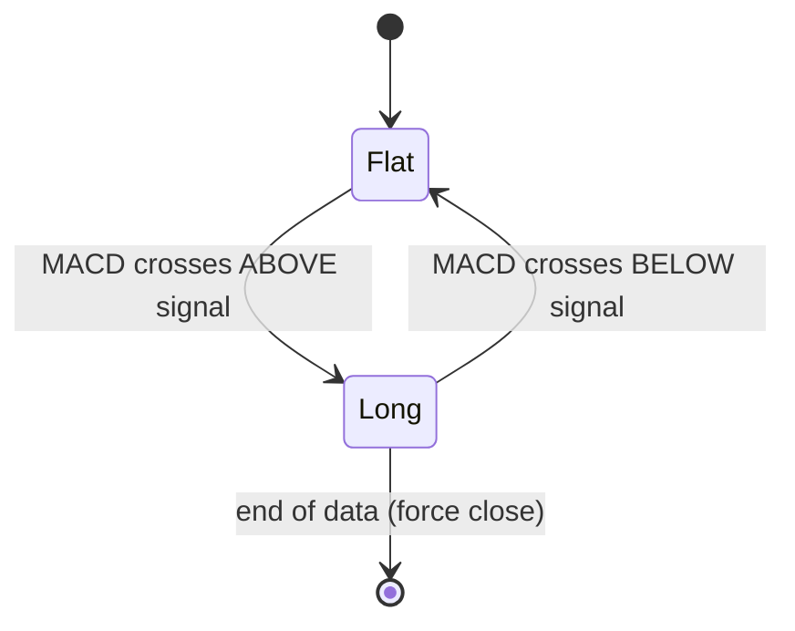
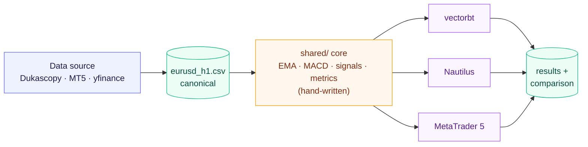
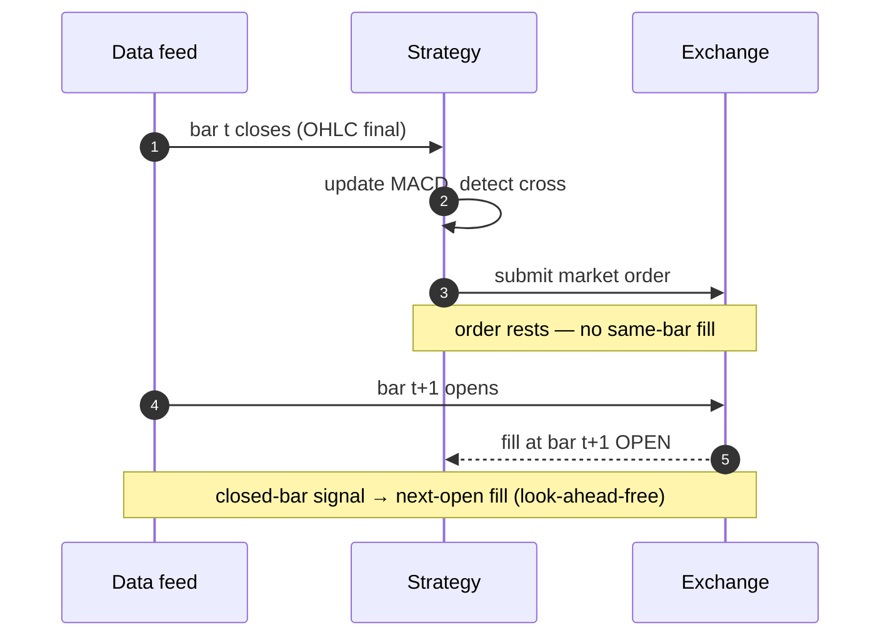

<h1 align="center">Triangulate</h1>

<p align="center"><i>One MACD strategy · three backtesting engines · cross-verified.</i></p>

<p align="center">
  
  
  
  
  <a href="https://github.com/guptabhishekumar/triangulate/actions/workflows/ci.yml"></a>
</p>

> The **same** MACD-crossover strategy — with **hand-written** indicator maths —
> implemented and back-tested across **vectorbt**, **Nautilus Trader**, and
> **MetaTrader 5** on identical EUR/USD H1 data, then reconciled number by number.
>
> *Triangulate*: three independent engines fix one result from three reference
> points — the way a position is triangulated from three bearings.

---

## Highlights

- **One hand-written EMA/MACD** (`shared/`) — no TA-Lib, no `vbt.MACD`, no `iMACD` —
  reused by every engine, so any difference is the **engine's**, not the maths'.
- **One canonical dataset** and **one metrics function** → a genuinely
  apples-to-apples comparison.
- All Python engines agree on **trade count exactly (484)** and returns to within
  **~0.08%** — the residual is a clean, explained fill-price effect.
- A **real one-bar look-ahead bug** in the Nautilus leg (it inflated Sharpe to 6.8)
  was found and fixed — documented honestly in [`NOTES.md`](NOTES.md).

## Results

EUR/USD · H1 · 2023-01-01 → 2024-12-31 · MACD(12, 26, 9) · long/flat · fixed
10,000-unit orders · \$100,000 · zero fees · fill at next bar's open · Sharpe ann. √6048.

| Engine | Total Return | Sharpe | Max Drawdown | Trades |
|---|---:|---:|---:|---:|
| vectorbt — vectorised | −0.0536% | −0.0469 | −0.6565% | 484 |
| Nautilus Trader — event-driven | −0.1340% | −0.1211 | −0.7249% | 484 |
| MetaTrader 5 — Python API (on CSV) | −0.0536% | −0.0469 | −0.6565% | 484 |
| MetaTrader 5 — Strategy Tester | _run locally — see [03_mt5](03_mt5/README.md)_ | | | |

A naive MACD crossover on EUR/USD H1 is ~break-even before costs — the result here
is the **consistency and reconciliation**, not the P&L. Full analysis:
[`results/comparison.md`](results/comparison.md).

## The strategy

```
MACD  = EMA(close, 12) − EMA(close, 26)
signal = EMA(MACD, 9)
EMA[t] = α·price[t] + (1−α)·EMA[t−1],   α = 2/(period+1),   EMA[0] = price[0]
```

Two EMAs of price (fast and slow), their difference, a third EMA that smooths it,
and a crossover detector:



Long on a bullish cross, flat on a bearish cross; the signal is read on a
**closed** bar and filled at the **next bar's open** (no look-ahead); no trades in
the first 35 (= 26 + 9) warm-up bars.



The position is always either flat or long:



## Architecture

Maths is decoupled from engine: one hand-written indicator + one metrics function,
shared by all three legs, fed by one canonical dataset.



Same logic, three execution models:

| Engine | Paradigm | MACD update | Order fill |
|---|---|---|---|
| **vectorbt** | vectorised (whole array) | batch over the array | shift signals +1, fill at open |
| **Nautilus** | event-driven (bar-by-bar) | incremental in `on_bar` | market order → next bar |
| **MetaTrader 5** | platform / `OnTick` | incremental on new bar | `CTrade.Buy` → next-bar open |

All three share the same look-ahead-free timing — decide on a closed bar, fill on
the next bar's open:



## Repository layout

```
shared/                     hand-written core (numpy/pandas only)
  config.py · indicators.py · signals.py · metrics.py · reference_backtest.py · data.py · results.py
data/        get_data.py (dukascopy | mt5 | yfinance) + eurusd_h1.csv (12,475 bars)
01_vectorbt/ run.py                                   02_nautilus/ run.py · strategy.py · macd_indicator.py
03_mt5/      macd_crossover_ea.mq5 · export_data.py · run.py
tests/       18 tests (EMA vs pandas oracle, metrics, reference P&L)
results/     metrics.csv · metrics.md · comparison.md · mt5_report.png*
compare.py · run_all.ps1 · NOTES.md
```
`*` added after running the EA in the Strategy Tester.

## Quick start

Each framework gets its **own** virtual environment; all read the same
`data/eurusd_h1.csv` and the same `shared/` package.

```bash
git clone https://github.com/guptabhishekumar/triangulate.git
cd triangulate
```

```powershell
# Windows · Python 3.12 — one command:
powershell -ExecutionPolicy Bypass -File run_all.ps1
```

<details>
<summary>Or run each leg manually</summary>

```bash
# data once + vectorbt
py -3.12 -m venv .venv-vectorbt && .venv-vectorbt\Scripts\activate
pip install -r 01_vectorbt/requirements.txt -r data/requirements.txt
python data/get_data.py --source dukascopy
python -m pytest tests -q          # 18 passing
python 01_vectorbt/run.py

# nautilus (separate env)
py -3.12 -m venv .venv-nautilus && .venv-nautilus\Scripts\activate
pip install -r 02_nautilus/requirements.txt
python 02_nautilus/run.py

# mt5 python api (separate env; falls back to the CSV if no terminal)
py -3.12 -m venv .venv-mt5 && .venv-mt5\Scripts\activate
pip install -r 03_mt5/requirements.txt
python 03_mt5/run.py

python compare.py                  # render results/metrics.md
```
</details>

The official MT5 result comes from running the EA in the **Strategy Tester** —
step-by-step in [`03_mt5/README.md`](03_mt5/README.md).

## Why the numbers differ (and what was held fixed)

| Source of difference | Handling |
|---|---|
| EMA seeding (SMA vs first-value vs `adjust=True`) | one hand-written convention, unit-tested vs pandas |
| Fill timing / look-ahead | "signal on closed bar → next-bar open" in all three |
| Sharpe annualisation (252 vs 6048 vs 8760) | recomputed with √6048 from each equity curve |
| "Number of trades" (round-trips vs fills vs deals) | round-trip closed positions everywhere |
| Fees (engine defaults) | forced to zero for the baseline |

The remaining Nautilus vs vectorbt gap (~0.08%) is a pure fill-price micro-difference
(≈0.16 pip/trade). Details: [`results/comparison.md`](results/comparison.md).

## Correctness & reproducibility

- **18 unit tests**: hand-written EMA == `pandas.ewm(adjust=False)` to 1e-10,
  EMA ≠ `adjust=True`, incremental == batch, metric formulas, reference P&L.
- vectorbt reproduces the glass-box reference engine **exactly**.
- Pinned per-leg dependencies; committed dataset with a published SHA-256; fixed
  UTC date range (no `datetime.now()` / relative windows).

## AI-assistance (honest log)

The brief encourages AI tools and asks where they helped or misled — see
[`NOTES.md`](NOTES.md). Two highlights: a confident-but-wrong claim that
open-source vectorbt was 0.27.2 (it is **1.0.0**, verified on PyPI), and the
Nautilus **look-ahead** caught by disbelief at a Sharpe of 6.8.

## License

[MIT](LICENSE) © 2026 Abhishek Kumar Gupta
