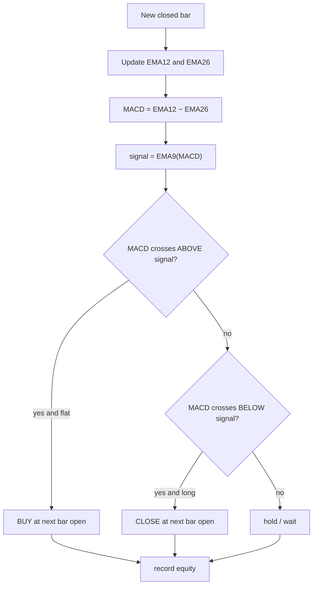
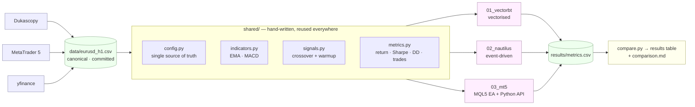
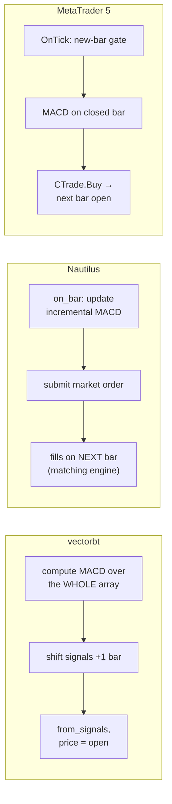

# Triangulate

### One MACD strategy · three backtesting engines · cross-verified

> The **same** MACD-crossover strategy, with **hand-written** indicator maths,
> implemented and back-tested across **vectorbt**, **Nautilus Trader**, and
> **MetaTrader 5** — on identical EUR/USD H1 data — then reconciled number by
> number.
>
> *Triangulate* — three independent engines fix one result from three reference
> points, the way a position is triangulated from three bearings.

<p>


</p>

---

## TL;DR

- One **hand-written** EMA/MACD (`shared/`) — no TA-Lib, no `vbt.MACD`, no `iMACD` —
  reused by every engine, so any difference in results is the **engine's**, not the maths'.
- One **canonical dataset** (committed CSV) and one **metrics function**, so the
  comparison is genuinely apples-to-apples.
- All Python engines agree on **trade count exactly (484)** and on returns to
  within **~0.08%**; the residual is a clean, explained fill-price effect.
- The interesting engineering is documented honestly — including a **one-bar
  look-ahead bug in the Nautilus leg that inflated Sharpe to 6.8**, how it was
  caught, and how it was fixed (see [`NOTES.md`](NOTES.md)).

---

## 1. The assignment

Implement one trading strategy across three different frameworks (vectorbt,
Nautilus Trader, MetaTrader 5), run a backtest in each, output the same four
metrics, and explain the differences — writing the MACD maths by hand in all
three.

## 2. The strategy — MACD crossover (long / flat)

```
MACD line   = EMA(close, 12) − EMA(close, 26)
signal line = EMA(MACD line, 9)
EMA[t]      = α·price[t] + (1−α)·EMA[t−1],   α = 2/(period+1),   EMA[0] = price[0]
```

- **Bullish cross** (MACD crosses **above** signal) → go **long**.
- **Bearish cross** (MACD crosses **below** signal) → **exit to flat**.
- Signal is read on a **closed** bar; the order fills at the **next bar's open**
  (no look-ahead). No trades during the first 35 (= 26 + 9) warm-up bars.



## 3. Results

EUR/USD H1 · 2023-01-01 → 2024-12-31 · MACD(12,26,9) · long/flat · fixed
10,000-unit orders · $100,000 · zero fees · fill at next bar open · Sharpe
annualised by √6048 · risk-free 0.

| Engine | Total Return | Sharpe | Max Drawdown | Trades |
|---|---:|---:|---:|---:|
| vectorbt (vectorised) | −0.0536% | −0.0469 | −0.6565% | 484 |
| Nautilus Trader (event-driven) | −0.1340% | −0.1211 | −0.7249% | 484 |
| MetaTrader 5 (Python API, on CSV) | −0.0536% | −0.0469 | −0.6565% | 484 |
| MetaTrader 5 (Strategy Tester) | _run locally — see [03_mt5](03_mt5/README.md)_ | | | |

A naive MACD crossover on EUR/USD H1 is ~break-even before costs — the headline
result is the **consistency and the reconciliation**, not the P&L. Full analysis:
[`results/comparison.md`](results/comparison.md).

## 4. Architecture

The design deliberately decouples **maths** from **engine**: one hand-written
indicator + one metrics function are shared by all three legs, fed by one
canonical dataset.



### The three execution models



## 5. Repository layout

```
.
├── shared/                     # framework-agnostic, hand-written core (numpy/pandas only)
│   ├── config.py               #   single source of truth (instrument, dates, params, fees…)
│   ├── indicators.py           #   EMA + MACD, by hand (adjust=False, first-value seed)
│   ├── signals.py              #   crossover → entries/exits (+ warmup mask)
│   ├── metrics.py              #   total return · Sharpe · max drawdown · trades
│   ├── reference_backtest.py   #   glass-box fixed-size simulator (baseline + MT5-Python)
│   ├── results.py              #   collect each engine's row into results/metrics.csv
│   └── data.py                 #   canonical CSV loader + SHA-256
├── data/
│   ├── get_data.py             # pull EUR/USD H1 (dukascopy | mt5 | yfinance) → CSV
│   └── eurusd_h1.csv           # committed canonical dataset (12,475 bars)
├── 01_vectorbt/   run.py + requirements + README
├── 02_nautilus/   run.py · strategy.py · macd_indicator.py + requirements + README
├── 03_mt5/        macd_crossover_ea.mq5 · export_data.py · run.py + requirements + README
├── tests/         test_indicators.py · test_metrics.py     (18 tests)
├── results/       metrics.csv · metrics.md · comparison.md · mt5_report.png*
├── compare.py     render the cross-framework table
├── run_all.ps1    one-command setup + run (Windows)
└── NOTES.md       dev log + honest AI-assistance notes
```
`*` `mt5_report.png` is produced when you run the EA in the Strategy Tester.

## 6. Quick start

> Each framework gets its **own** virtual environment (clean isolation). All read
> the same `data/eurusd_h1.csv` and the same `shared/` package.

```bash
git clone https://github.com/guptabhishekumar/triangulate.git
cd triangulate
```

**One command (Windows, Python 3.12):**
```powershell
powershell -ExecutionPolicy Bypass -File run_all.ps1
```

**Or per leg:**
```bash
# data (once)
py -3.12 -m venv .venv-vectorbt && .venv-vectorbt\Scripts\activate
pip install -r 01_vectorbt/requirements.txt -r data/requirements.txt
python data/get_data.py --source dukascopy
python -m pytest tests -q          # 18 passing
python 01_vectorbt/run.py

# nautilus (separate env)
py -3.12 -m venv .venv-nautilus && .venv-nautilus\Scripts\activate
pip install -r 02_nautilus/requirements.txt
python 02_nautilus/run.py

# mt5 python api (separate env) — falls back to the CSV if no terminal
py -3.12 -m venv .venv-mt5 && .venv-mt5\Scripts\activate
pip install -r 03_mt5/requirements.txt
python 03_mt5/run.py

python compare.py                  # render results/metrics.md
```
The official MT5 result comes from running the EA in the **Strategy Tester** —
step-by-step in [`03_mt5/README.md`](03_mt5/README.md).

## 7. Why the numbers differ (and what was held fixed)

| Source of difference | Handling |
|---|---|
| EMA seeding (SMA vs first-value vs `adjust=True`) | one hand-written convention everywhere, unit-tested vs pandas |
| Fill timing / look-ahead | "signal on closed bar → next-bar open" in all three |
| Sharpe annualisation (252 vs 6048 vs 8760) | recomputed ourselves with √6048 from each equity curve |
| "Number of trades" (round-trips vs fills vs deals) | round-trip closed positions everywhere |
| Fees (engine defaults) | forced to zero for the baseline |

The remaining Nautilus vs vectorbt gap (~0.08%) is purely a fill-price
micro-difference (≈0.16 pip/trade). Details: [`results/comparison.md`](results/comparison.md).

## 8. Correctness & reproducibility

- **18 unit tests**: hand-written EMA == `pandas.ewm(adjust=False)` to 1e-10,
  EMA ≠ `adjust=True`, incremental == batch EMA, metric formulas, and the
  reference engine's P&L on a hand-checked trade.
- **Cross-check**: vectorbt reproduces the glass-box reference engine exactly.
- **Pinned** dependencies per leg; **committed** dataset with a published SHA-256;
  fixed UTC date range (no `datetime.now()` / relative windows).

## 9. AI-assistance (honest log)

The assignment encourages AI coding tools and asks where they helped or misled.
See [`NOTES.md`](NOTES.md) — highlights:

- An AI claim that "open-source vectorbt is 0.27.2 / 1.0 is paid" was **wrong**;
  verified on PyPI that **1.0.0 is the community edition** → avoided a needless
  numpy-1.x env split.
- The Nautilus **look-ahead** (Sharpe 6.8) was caught by disbelief at the number,
  then by inspecting fills — and fixed.

## 10. License

[MIT](LICENSE) © 2026 Abhishek Kumar Gupta
